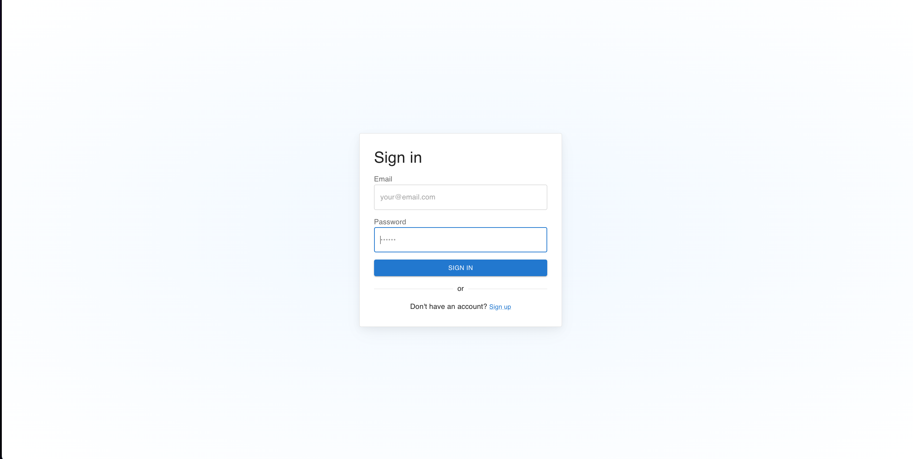
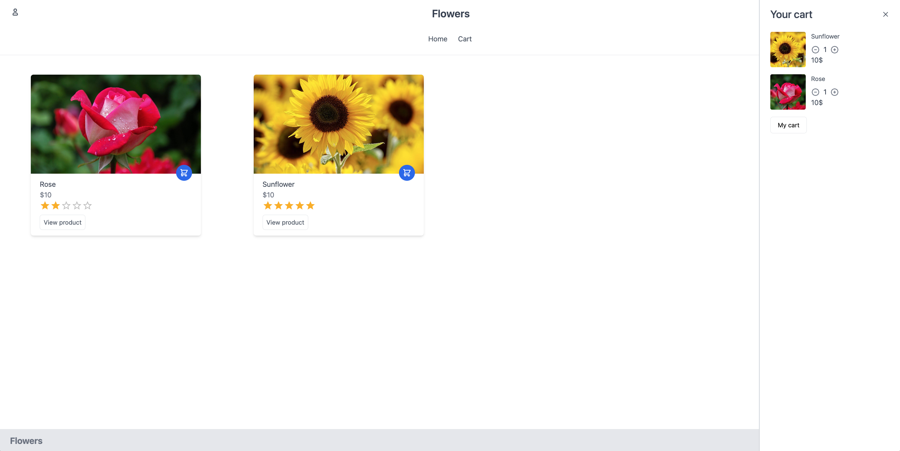
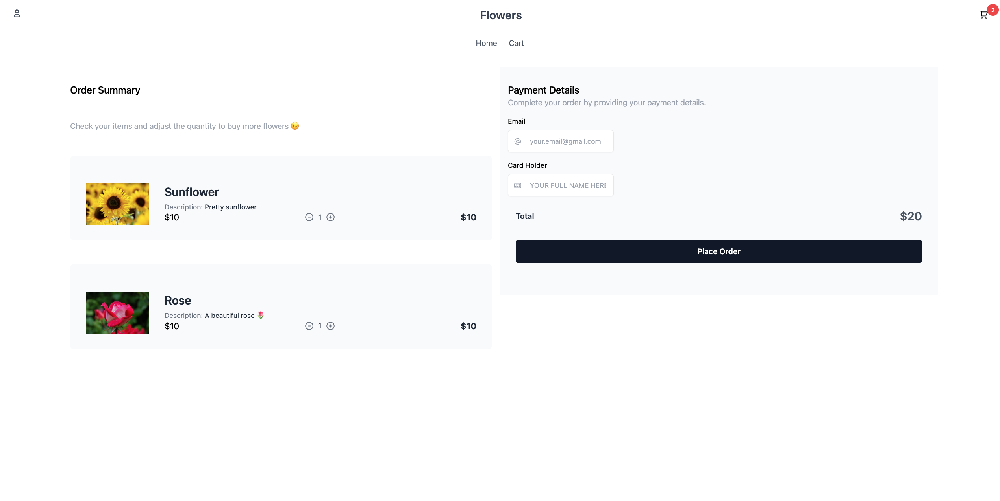

#  React Webshop — Fullstack E-commerce Project

A full-featured, modern webshop built with **React** on the frontend and **Node.js**, **Express**, and **MariaDB** on the backend. The project uses **Sequelize** as an ORM to manage SQL-based data efficiently. The architecture follows a clean, modular service-based structure, making it scalable, maintainable, and easy to extend.

---

###  Architecture Breakdown
- **Frontend**: React + Tailwind CSS
- **API Layer** (`Express`)
  - `app.js` connects routes and middleware.
  - `userRoutes` and `productRoutes` handle incoming API requests.
- **Service Layer**
  - `userService` and `productService` process logic and forward queries to the database layer.
- **Sequelize Models**
  - Models define the schema and handle relationships with MariaDB.
- **Database**: **MariaDB** (via Sequelize)

---

##  Database & Sequelize Models

###  Database: MariaDB

The project uses **MariaDB**, a robust, open-source SQL database system ideal for transactional applications and large data operations.

###  Sequelize ORM

All database interactions are abstracted using Sequelize, which allows:
- Defining models for tables
- Auto-generating queries
- Managing associations (e.g. one-to-many, many-to-many)

###  Database Tables

- `user`: Stores user data (ID, name, email, password)
- `products`: Contains all product information
- `cart`: Maps users to products with quantities
- `rating`: Handles product reviews and ratings

###  Relationships

- **user ↔ cart**: One-to-many
- **user ↔ rating**: One-to-many
- **product ↔ rating**: One-to-many
- **cart ↔ products**: Many-to-many via cart table

---

##  Key Features (Frontend)

###  Core User Flow
- Browse products with dynamic rendering
- Add/remove items to/from cart
- View product details
- Adjust item quantities
- Cart persists across app views

###  Cart System
- Managed by `CartContext` (React Context API)
- Real-time updates across components
- Sidebar and navbar badge stay in sync

###  Smart Component Design
- `Navbar`, `CartSidebar`, `CartItems`, and `UserDropdown` extracted into separate reusable components
- Clean state flow: no prop drilling

###  Image Pathing
- Product images are referenced by filename only (e.g. `flower.jpg`)
- Frontend resolves them as full URLs (e.g. `http://localhost:3001/images/flower.jpg`)

---

### Folder Structure

- frontend/
  - public/
  - src/
    - components/
      - CartSidebar.js
      - CartItems.js
      - Navbar.js
      - UserDropdown.js
    - context/
      - CartContext.js
    - pages/
      - ProductList.js
      - ProductDetails.js
      - MyCart.js
    - App.js
    - main.jsx

- backend/
  - app.js
  - config/
    - database.js
  - models/
    - user.js
    - product.js
    - cart.js
    - rating.js
  - routes/
    - userRoutes.js
    - productRoutes.js
  - services/
    - userService.js
    - productService.js

- .env
- package.json
- README.md


### Service Logic

Each route is mapped to a service:
- `userRoutes` → `userService`
- `productRoutes` → `productService`

These services are the brain of your backend logic:
- Validate data
- Communicate with Sequelize models
- Handle business logic and structure responses

---

##  Setup Instructions

###  Prerequisites

- Node.js
- MariaDB
- npm or yarn

### Backend Setup

```bash
cd backend
npx sequelize-cli db:migrate
node server.js
```
	
 Create a .env file based on .env.example and fill in DB credentials.
	
 • Run Sequelize migrations or sync models directly.
 
 Start server: node app.js

 ## Frontend setup
```bash
cd frontend
npm install
npm run dev  # or npm start if using CRA
```

### Environment Variables

Example .env setup:

```bash
DB_HOST=localhost
DB_PORT=3306
DB_NAME=react_webshop
DB_USER=root
DB_PASSWORD=yourpassword
```

### Author

- Adrian Nasrat
- Systems Scientist | Dalarna University
- Junior Software Engineer
- Portfolio: https://a-n-v.vercel.app/
- GitHub: https://github.com/aliadrian

# Images of the shop
### Login page

### Home page

### Cart page

